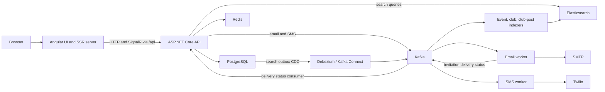

# Architecture

EventXperience is an Angular web client and an ASP.NET Core modular application with separately deployed background workers. PostgreSQL is authoritative; caches, search indices, and probabilistic filters support reads without replacing database validation.

## Frontend

`frontend/src/app/features/` groups product areas. `core/` contains application-wide services, HTTP interceptors, guards, feature flags, and NgRx user/session stores; `shared/` contains reusable UI and utilities. The application mixes existing NgModules with standalone components and lazy route trees.

The application enables SSR and client hydration with event replay. HTTP transfer caching and incremental hydration are explicitly disabled in `app.config.ts`; authenticated requests are issued again in the browser. The application retains ZoneJS change detection. Preserve these choices unless the task explicitly changes them.

During development, `proxy.conf.mjs` forwards `/api` including WebSocket upgrades. The built Express SSR server serves static assets and Angular pages, proxies API requests, and tunnels hub WebSockets. Public configuration is generated into `src/environments/environment.ts`; browser code must not receive server secrets. See the [frontend README](../frontend/README.md).

## Backend

The entry point is `backend/src/main/Program.cs`. `application/` configures startup, DI, routes, response conventions, middleware, security, OpenAPI, and feature flags. `features/` groups auth, profile, clubs, events, payments, search, cache, and bloom-filter behavior. `infrastructure/` owns database, Redis, and Elasticsearch integration; `shared/` owns common contracts, storage, messaging, and utilities.

Controllers bind requests and enforce HTTP/security contracts, services implement business rules, and repositories perform persistence operations. Services are registered through the existing bootstrap container. Repository/cache proxy and resilience behavior should be preserved when adding dependencies. DTOs isolate API contracts from database entities.

Normal startup validates settings, verifies the database connection, applies EF Core migrations, and optionally seeds data. `Testing` and OpenAPI export suppress startup side effects; integration fixtures supply infrastructure and state themselves. Middleware handles forwarded headers, exceptions, request IDs, timeouts, headers/HTTPS, CORS, CSRF, authentication, authorization, and rate limiting. MVC routes receive the `/api` prefix; the club hub is mapped explicitly at `/api/hubs/clubs`.

## Infrastructure and asynchronous work

- **PostgreSQL / EF Core:** Application records, transactions, versions, registrations, invitations, and search outbox rows. Migrations live in `backend/Migrations/`.
- **Redis:** Cached data, shared state, and bloom-filter bitmaps. Read-only availability probes can use bloom results; account writes still check the database. Rebuilds replace filter generations because bloom filters cannot delete individual values.
- **Elasticsearch:** Event, club, and club-post search documents. Search code includes database fallback behavior; index updates are eventually consistent.
- **Kafka Connect:** Debezium captures PostgreSQL outbox rows and routes search messages to Kafka. The three connector definitions and registration script live in `docker/kafka-connect/`.
- **Workers:** Three indexers apply search updates/deletes, the email worker sends SMTP messages and publishes invitation status, and the SMS worker sends Twilio MFA messages. Read their [READMEs](../backend/README.md#workers) for configuration and differing failure policies.

Feature flags control backend endpoint discovery, selected service registrations and hosted services, and frontend navigation/lazy matching. Backend-only flags and shared frontend flags differ; see [configuration](CONFIGURATION.md). See [testing](TESTING.md) for isolated container-backed fixtures and [deployment](DEPLOYMENT.md) for operational limitations.
