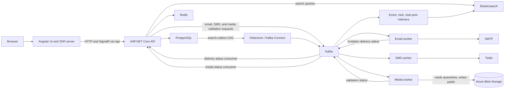
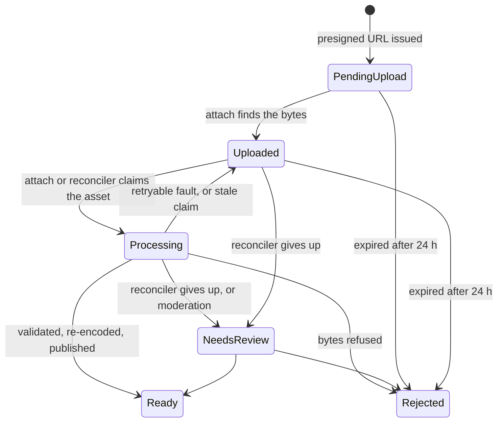

# Architecture

EventXperience is an Angular web client and an ASP.NET Core modular application with separately deployed background workers. PostgreSQL is authoritative; caches, search indices, and probabilistic filters support reads without replacing database validation.

```mermaid
flowchart LR
    Browser --> Angular[Angular UI and SSR server]
    Angular -->|HTTP and SignalR via /api| API[ASP.NET Core API]
    API --> PostgreSQL
    API --> Redis
    API -->|search queries| Elasticsearch
    API -->|email, SMS, and media validation requests| Kafka
    PostgreSQL -->|search outbox CDC| Connect[Debezium / Kafka Connect]
    Connect --> Kafka
    Kafka --> Indexers[Event, club, club-post indexers]
    Indexers --> Elasticsearch
    Kafka --> Email[Email worker]
    Email --> SMTP
    Email -->|invitation delivery status| Kafka
    Kafka -->|delivery status consumer| API
    Kafka --> SMS[SMS worker]
    SMS --> Twilio
    Kafka --> Media[Media worker]
    Media -->|reads quarantine, writes public| Blob[(Azure Blob Storage)]
    Media -->|validation status| Kafka
    Kafka -->|media status consumer| API
```

## Frontend

`frontend/src/app/features/` groups product areas. `core/` contains application-wide services, HTTP interceptors, guards, feature flags, and NgRx user/session stores; `shared/` contains reusable UI and utilities. The application mixes existing NgModules with standalone components and lazy route trees.

The application enables SSR and client hydration with event replay. HTTP transfer caching and incremental hydration are explicitly disabled in `app.config.ts`; authenticated requests are issued again in the browser. The application retains ZoneJS change detection. Preserve these choices unless the task explicitly changes them.

During development, `proxy.conf.mjs` forwards `/api` including WebSocket upgrades. The built Express SSR server serves static assets and Angular pages, proxies API requests, and tunnels hub WebSockets. Public configuration is generated into `src/environments/environment.ts`; browser code must not receive server secrets. See the [frontend README](../frontend/README.md).

## Backend

The entry point is `backend/src/main/Program.cs`. `application/` configures startup, DI, routes, response conventions, middleware, security, OpenAPI, and feature flags. `features/` groups auth, profile, clubs, events, payments, search, cache, and bloom-filter behavior. `infrastructure/` owns database, Redis, and Elasticsearch integration; `shared/` owns common contracts, storage, messaging, and utilities.

Controllers bind requests and enforce HTTP/security contracts, services implement business rules, and repositories perform persistence operations. Services are registered through the existing bootstrap container. Repository/cache proxy and resilience behavior should be preserved when adding dependencies. DTOs isolate API contracts from database entities.

Normal startup validates settings, verifies the database connection, applies EF Core migrations, and optionally seeds data. `Testing` and OpenAPI export suppress startup side effects; integration fixtures supply infrastructure and state themselves. Middleware handles forwarded headers, exceptions, request IDs, timeouts, headers/HTTPS, CORS, CSRF, authentication, authorization, and rate limiting. MVC routes receive the `/api` prefix; the club hub is mapped explicitly at `/api/hubs/clubs`.

## Infrastructure and asynchronous work

- **PostgreSQL / EF Core:** Application records, transactions, versions, registrations, invitations, and search outbox rows. Migrations live in `backend/Migrations/`.
- **Redis:** Cached data, shared state, and bloom-filter bitmaps. Read-only availability probes can use bloom results; account writes still check the database. Rebuilds replace filter generations because bloom filters cannot delete individual values.
- **Elasticsearch:** Event, club, and club-post search documents. Search code includes database fallback behavior; index updates are eventually consistent.
- **Kafka Connect:** Debezium captures PostgreSQL outbox rows and routes search messages to Kafka. The three connector definitions and registration script live in `docker/kafka-connect/`.
- **Workers:** Three indexers apply search updates/deletes, the email worker sends SMTP messages and publishes invitation status, the SMS worker sends Twilio MFA messages, and the media worker validates and re-encodes attached image uploads and publishes each verdict. No worker connects to PostgreSQL; the API records what the email and media workers report. Read their [READMEs](../backend/README.md#workers) for configuration and differing failure policies.
- **Azure Blob Storage:** Two containers in one storage account. The public container, which allows anonymous blob reads, serves every image. The private quarantine container receives browser uploads until they have been validated. The API never creates containers; see [deployment](DEPLOYMENT.md#blob-storage).

## Image uploads

Avatars are posted to the API, which decodes and re-encodes them before storing anything. Event, club, and series images are uploaded by the browser straight to storage through a presigned URL, so the server first sees those bytes when they are attached.

With `storage.quarantine` on (the default), a presigned upload lands in the quarantine container, and a `MediaAssets` row tracks it through this lifecycle:

```mermaid
stateDiagram-v2
    [*] --> PendingUpload: presigned URL issued
    PendingUpload --> Uploaded: attach finds the bytes
    Uploaded --> Processing: attach or reconciler claims the asset
    Processing --> Ready: validated, re-encoded, published
    Processing --> Rejected: bytes refused
    Processing --> Uploaded: retryable fault, or stale claim
    Processing --> NeedsReview: reconciler gives up, or moderation
    Uploaded --> NeedsReview: reconciler gives up
    NeedsReview --> Ready
    NeedsReview --> Rejected
    PendingUpload --> Rejected: expired after 24 h
    Uploaded --> Rejected: expired after 24 h
```

The presigned endpoint reserves the image's public URL with a `.webp` name. The client attaches that URL exactly as it did before quarantine, so none of the attach paths changed shape. Attaching the URL claims the asset and has the validation pipeline (`MediaValidationPipeline`) run on it. Where it runs depends on `storage.quarantine.inline`: inside the attach request (the default), or in media-worker. The pipeline:

1. Checks the size and byte signature.
2. Decodes one frame and resizes it to the gallery edge.
3. Applies the EXIF orientation, strips all metadata, and encodes WebP.
4. Writes the result to the reserved URL.

The quarantine copy is deleted only after the outcome is recorded, so a crash in between retries from intact bytes. Every state change is a conditional update, and an illegal move, such as Ready back to Processing, throws. `MediaValidationRecorder` is the only code that moves an asset to Ready or Rejected, whichever process ran the pipeline. It records an outcome only while the asset is still Processing under the claim the outcome belongs to, so a redelivered or superseded verdict changes nothing.

### Validating in media-worker

With `storage.quarantine.inline` off, the flow is:

1. Attach claims the asset, which bumps `AttemptCount`, and publishes a request with `IPublisher`. The request carries the asset id, the claim number, the quarantine path, the reserved URL, and the declared type.
2. [media-worker](../backend/src/worker/media-worker/README.md) runs the unchanged pipeline and publishes the verdict on a status topic. It never connects to PostgreSQL; it needs only Kafka and the storage account.
3. The API's `MediaValidationStatusConsumer` records the verdict. This mirrors the email worker's invitation status path.
4. Meanwhile, attach polls the row for up to ten seconds. Ready proceeds, Rejected returns its reason, and a timeout returns 409, "still being checked". The editor already polls `GET /api/media/{publicId}` and retries.

There is no outbox for these requests. The outbox exists to make a Kafka publish atomic with a database write when nothing else records that the work is owed. Here the `MediaAssets` row already records it: an asset in Uploaded or Processing is queryable, undelivered work. `MediaValidationReconciler` runs every minute and re-drives assets the worker never answered: a request lost before the broker, a worker killed mid-pipeline, or a dead-lettered request. It releases and re-claims each one, backing off by `AttemptCount` (2, 4, 8 minutes, up to 30). After five claims it parks the asset in NeedsReview rather than retry a poison image forever.

**Public reads never see an unvalidated image, by construction.** An attach path writes a URL onto an event, club, or user only after its asset is Ready, so a rejected or unfinished upload never reaches a row a public page reads, and no read path filters on asset status. That holds in both modes, because attach waits for the worker's verdict rather than returning before it.

The alternative, attach returning as soon as the request is published, would need two changes:

- An explicit `Status = Ready` filter on every public read path.
- A publish rule: allow an event to be published while its cover is still Processing, and block publishing when the cover is Rejected.

That remains an option if the bounded wait proves too slow.

`QuarantineReaper` runs hourly. It does three things:

- It releases claims stuck in Processing for more than five minutes, back to Uploaded. That covers an attach killed mid-pipeline, where no exception handler ran. In media-worker mode the reconciler usually re-drives such claims first.
- It expires uploads that were issued and never attached within 24 hours.
- It deletes quarantined blobs older than a day that no asset is working on. The orphan sweeper cannot see the quarantine container, and nothing else removes a blob a client uploaded and never attached. It keeps the bytes of NeedsReview assets, since a reviewer can still approve them. The reaper is gated on the `storage` parent flag, so turning quarantine off still drains what it holds. The orphan sweeper treats the public URL of an upload still in flight (not yet Ready or Rejected) as a reference, so a promotion awaiting its Ready write is never swept. Once an asset has settled, only the owning columns count. An image removed from its event, or promoted by an attach whose save then failed, is therefore reclaimed like any other orphan, and its ledger row is deleted with the blob.

`MediaAssets` is an upload ledger, not a reference count. Nothing references it by foreign key yet. Deleting an event deletes its blobs but leaves their asset rows, and one URL can be shared by several recurrence occurrences. Existing images were backfilled as `Legacy` assets with `ValidatedAt` null, which marks the backlog that was never re-checked.

With `storage.quarantine` off, uploads go straight to the public container and are checked in place for size and signature when attached, as they were before quarantine.

Feature flags control backend endpoint discovery, selected service registrations and hosted services, and frontend navigation/lazy matching. Backend-only flags and shared frontend flags differ; see [configuration](CONFIGURATION.md). See [testing](TESTING.md) for isolated container-backed fixtures and [deployment](DEPLOYMENT.md) for operational limitations.
